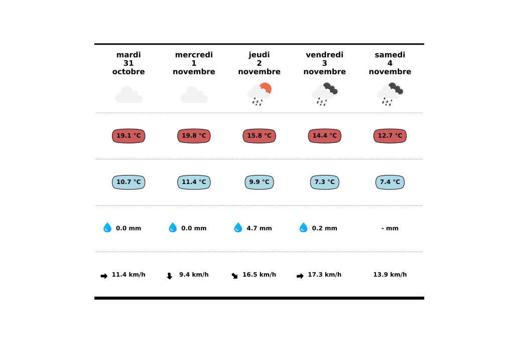

# 🌦️ Projet : Prévision météo à 5 jours — Montpellier

Ce projet a pour objectif de générer automatiquement une page web affichant les prévisions météo à **5 jours** pour la ville de **Montpellier**, avec une **mise à jour quotidienne** des données.  
🔗 **Site en ligne :** https://meteo-gbr.github.io/

---

## 📊 Aperçu

| Informations affichées | Contenu |
|-----------------------|---------|
| Conditions météo | Icône issue des codes WMO |
| Températures | Température minimale & maximale |
| Précipitations | Cumul journalier |
| Vent | Vitesse moyenne + direction dominante |
| Données manquantes | Icône absente si info indisponible |

Aperçu visuel du tableau généré :

---

## ⚙️ Technologies utilisées

| Catégorie | Choix technique |
|----------|-----------------|
| Langage principal | **Python** |
| Visualisation graphique | **matplotlib** |
| Génération site & build | **Quarto** |
| Hébergement | **GitHub Pages** |
| Automatisation (CI/CD) | **GitHub Actions** |
| Source des données météo | **open-meteo.com** |

---

### 📁 Structure & pipeline des données

Trois DataFrames principaux ont été construits :

1. **DataFrame brut** – données météo journalières
2. **DataFrame vent** – calcul du vent moyen & intégration au DF principal
3. **Table de correspondance WMO → icônes**

L’affichage final prend la forme d'une figure *matplotlib*, dans laquelle chaque cellule est composée d’annotations et d’images placées manuellement.

---

## 🚀 CI/CD & automatisation

Le site est mis à jour quotidiennement grâce à **GitHub Actions** qui :

1. récupère les nouvelles données météo,
2. génère la figure graphique via Python,
3. publie automatiquement la page via Quarto sur **GitHub Pages**.

📄 Configuration utilisée :  
🔗 [`publish.yml`](https://github.com/Guillaume-BR/Guillaume-BR.github.io/blob/main/.github/workflows/publish.yml)  
🔗 [`_quarto.yml`](https://github.com/Guillaume-BR/Guillaume-BR.github.io/blob/main/_quarto.yml)

---

## 🔗 Ressources externes

| Ressource | Lien |
|----------|------|
| API météo | https://open-meteo.com/en/docs |
| Génération visuels tableau | https://www.sonofacorner.com/beautiful-tables/ |
| Icônes météo WMO (JSON) | https://gist.github.com/stellasphere/9490c195ed2b53c707087c8c2db4ec0c |
| Documentation Quarto | https://quarto.org/docs/publishing/github-pages.html |

---

## 📬 Contact

👤 **Guillaume Bernard-Reymond**  
📩 **guillaume.bernardreymond@gmail.com**

N’hésitez pas à me contacter pour toute suggestion, échange technique ou amélioration du projet.
