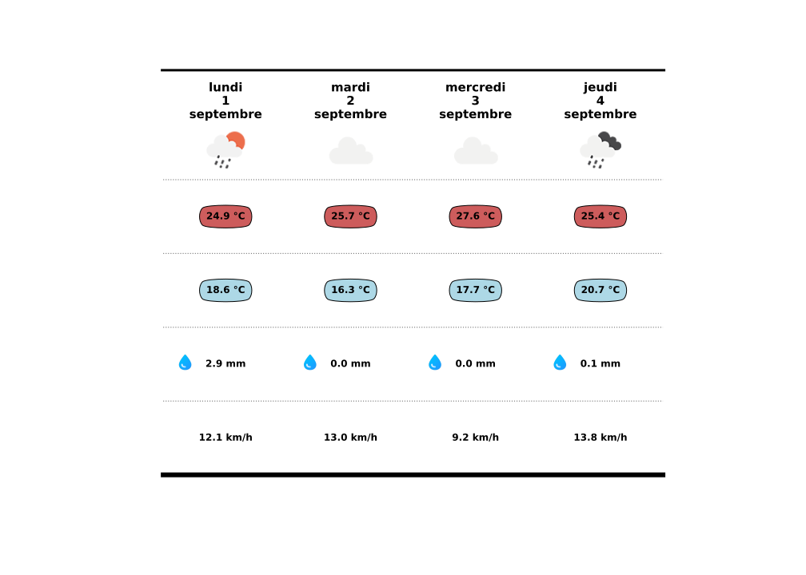

# Projet météo

Dans ce projet météo, l'objectif était de créer une page web permettant d'afficher la météo à 5 jours pour la ville de Montpellier avec une actualisation quotidienne.

Le résultat obtenu est visible en cliquant sur [ce lien](https://meteo-gbr.github.io/) ! 

## Les éléments demandés

Voici un aperçu de l'affichage : 

On peut voir : 
* le temps approximatif du jour
* la température maximale
* la température minimale
* le cumul des précipitations 
* le vent moyen avec la direction principale

Pour le cumul des précipitations et le vent moyen, il y a une absence d'icône lorsque les données étaient manquantes.

## Détails techniques

Pour réaliser cette page, j'ai utilisé des données issus du site suivant : [open-meteo](https://open-meteo.com/en/docs).

Tout le développement a été fait en Python et notamment le visuel où j'ai utilisé le package matplotlib. Le rendu correspond à un graphique où les données sont en fait des annotations et images placées aux endroits désirés.

J'ai utilisé trois dataframes :
* un pour les données journalières ;
* un pour calculer le vent moyen quotidien et l'intégrer au premier ;
* un dernier permettant de faire le lien entre les codes wmo (weather code) et les icônes.

Enfin c'est à l'aide de l'utilitaire Quarto et le sytème GitHub-pages que j'ai pu faire le déploiement de la page.

## Source

Pour réaliser le tableau, ce [tutoriel](https://www.sonofacorner.com/beautiful-tables/) bien détaillé a été très utile.

Les icônes de la météo du jour ont été obtenues à l'aide du fichier json suivant : [lien](https://gist.github.com/stellasphere/9490c195ed2b53c707087c8c2db4ec0c)

Pour le déploiement, j'ai principalement utilisé la documentation de [Quarto](https://quarto.org/docs/publishing/github-pages.html). 

L'actualisation a été la plus grosse difficulté du projet. Vous pouvez voir des exemples des fichiers yml qui ont permis le déploiement : [publish.yml](https://github.com/Guillaume-BR/Guillaume-BR.github.io/blob/main/.github/workflows/publish.yml) et [_quarto.yml](https://github.com/Guillaume-BR/Guillaume-BR.github.io/blob/main/_quarto.yml)

## Contact

Guillaume Bernard-Reymond : guillaume.bernard-reymond@etu.umontpellier.fr